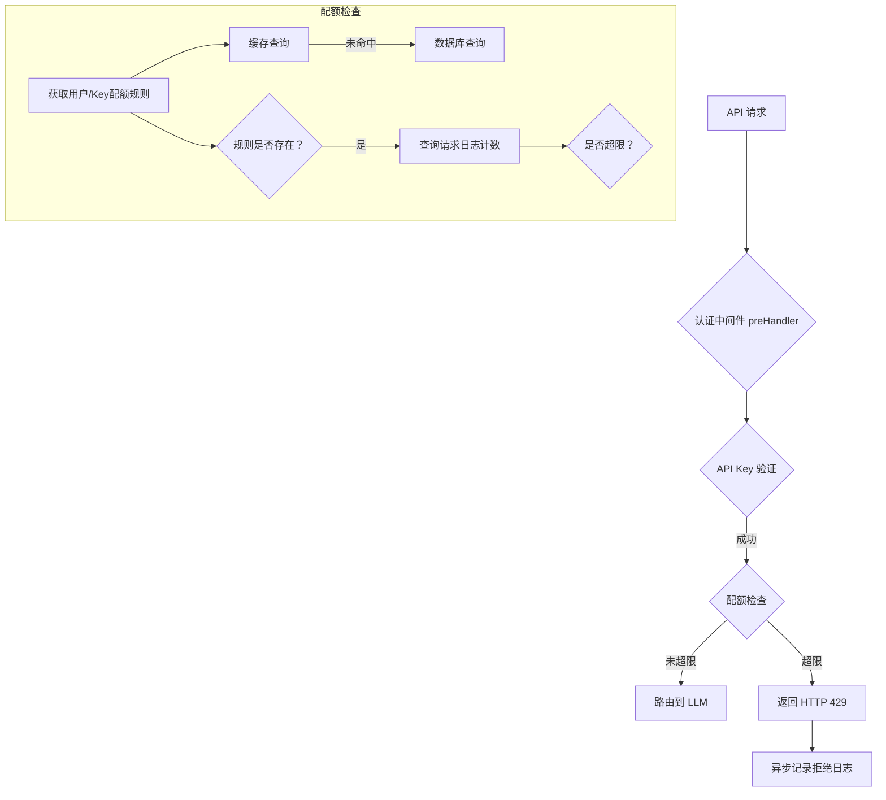

# 设计文档

## 概述

本文档描述了 `claude-code-router` 配额系统的技术设计，该系统旨在限制用户和 API 密钥在特定时间窗口内的请求次数。设计遵循 `.spec-workflow/specs/quota/requirements.md` 中定义的需求，并基于已确认的技术栈（MySQL, Worker Threads, 内存缓存）。

## 指导文档对齐

### 技术标准 (tech.md)

- **数据库**: 采用 MySQL 存储配额规则和请求日志，与 `tech.md` 一致。
- **异步处理**: 利用 Node.js `worker_threads` 进行日志记录，避免阻塞主线程，符合性能要求。
- **缓存**: 使用 `lru-cache` 实现内存缓存，以提升配额规则的读取性能。

### 项目结构 (structure.md)

- **`src/services/quotaService.ts`**: 将创建此文件以封装所有配额相关的业务逻辑。
- **`src/middleware/auth.ts`**: 将修改此文件以集成配额检查逻辑。
- **`src/api/`**: 将在 `admin` 和 `keys` 路由下添加配额管理的端点。

## 代码重用分析

### 要利用的现有组件

- **API 认证中间件 (`src/middleware/auth.ts`)**: 配额检查逻辑将作为认证成功后的一个步骤集成到此中间件中。
- **数据库连接 (`src/db/client.ts`)**: 配额服务将重用现有的数据库连接来查询 `request_logs` 和配额规则表。
- **内存缓存 (`src/utils/cache.ts`)**: 将扩展或重用现有的缓存工具来缓存配额规则，减少数据库负载。
- **异步日志 Worker**: 将利用现有的日志 Worker 来记录配额超限的请求。

### 集成点

- **`preHandler` 钩子**: 配额检查是认证流程的关键部分。
- **`request_logs` 表**: 该表是计算当前请求数的直接数据来源。
- **UI 应用**: 配额管理功能将集成到现有的管理员面板和用户 API 密钥管理页面中。

## 架构

配额系统将作为认证流程的一部分，通过在内存中缓存配额规则并查询请求日志来实现高效的请求控制。

### 模块化设计原则

- **单一文件职责**: `quotaService.ts` 将专门负责配额的计算和检查逻辑。
- **组件隔离**: 缓存、数据库查询和 API 端点将作为独立的功能部分。
- **服务层分离**: 配额检查的业务逻辑将与 API 路由处理和数据访问清晰地分离开。

## 组件和接口

### 组件1: QuotaService (`src/services/quotaService.ts`)

- **目的:** 封装所有与配额相关的业务逻辑，包括规则获取和请求计数。
- **接口:**
  - `checkUserQuota(userId: string): Promise<{exceeded: boolean}>`
  - `checkApiKeyQuota(apiKeyId: string): Promise<{exceeded: boolean}>`
  - `getRuleForUser(userId: string): Promise<QuotaRule | null>`
  - `getRuleForApiKey(apiKeyId: string): Promise<QuotaRule | null>`
- **依赖:** PrismaClient, `lru-cache` 实例。
- **重用:** 数据库连接和缓存工具。

### 组件2: 配额管理 API

- **目的:** 提供用于管理配额规则的 HTTP 端点。
- **接口:**
  - `PUT /admin/users/{userId}/quota`
  - `DELETE /admin/users/{userId}/quota`
  - `PUT /api/keys/{keyId}/quota`
  - `DELETE /api/keys/{keyId}/quota`
- **依赖:** QuotaService, 认证中间件。

## 数据模型

### `user_quotas`
- `user_id` (关联 `users`)
- `limit` (INTEGER)
- `interval_minutes` (INTEGER)

### `api_key_quotas`
- `api_key_id` (关联 `api_keys`)
- `limit` (INTEGER)
- `interval_minutes` (INTEGER)

## 错误处理

### 错误场景

1. **场景: 配额超限**
   - **处理:** `preHandler` 钩子捕获 `QuotaService` 的超限结果，立即中断请求并返回 `HTTP 429 Too Many Requests`。
   - **用户影响:** 客户端收到明确的速率限制错误，并可能根据 `Retry-After` 头部进行重试。
2. **场景: 配额规则更新失败**
   - **处理:** API 端点捕获数据库错误，返回 `HTTP 500 Internal Server Error`。
   - **用户影响:** 管理员或用户在 UI 上看到操作失败的提示。

## 测试策略

### 单元测试

- 测试 `QuotaService` 中配额规则的缓存逻辑（命中、未命中、失效）。
- 测试时间窗口计算和数据库查询语句的构建是否正确。

### 集成测试

- 模拟一系列请求，精确测试配额检查的边界条件（未超限、刚好达到、超限）。
- 测试用户配额和 API 密钥配额的独立性和组合效果。
- 测试配额管理 API 的 CRUD 操作，并验证缓存是否被正确清除。
- 验证配额超限时是否正确返回 429 状态码，并检查 `request_logs` 中是否生成了类型为 `quota_exceeded` 的日志。

### 性能测试 (可选)

- 在高并发环境下对受配额限制的端点进行压力测试，以评估 `request_logs` 表的查询性能是否成为瓶颈，并确定是否需要进一步优化（如引入 Redis）。

## 原始文档的附加内容

### API 设计

#### 用户配额 (管理员权限)
- **`PUT /admin/users/{userId}/quota`**: 设置或更新用户的配额规则。 `{ "limit": number, "interval_minutes": number }`
- **`DELETE /admin/users/{userId}/quota`**: 移除用户的配额规则。
- **`GET /admin/users/{userId}/quota`**: 获取用户的配额规则。

#### API 密钥配额 (用户权限)
- **`PUT /api/keys/{keyId}/quota`**: 设置或更新指定 API Key 的配额规则。`{ "limit": number, "interval_minutes": number }`
- **`DELETE /api/keys/{keyId}/quota`**: 移除指定 API Key 的配额规则。
- **`GET /api/keys/{keyId}/quota`**: 获取指定 API Key 的配额规则。
