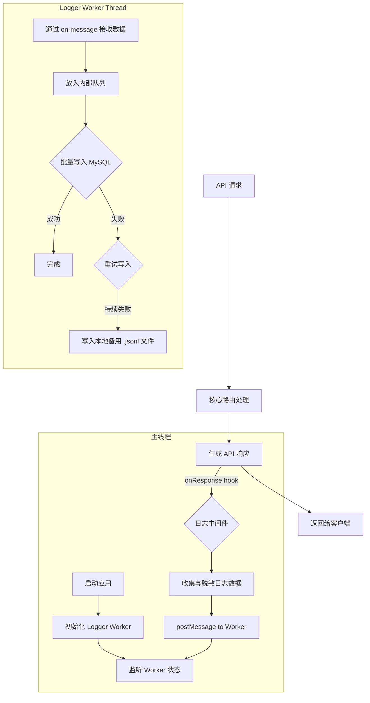

# 设计文档

## 概述

本文档描述了 `claude-code-router` 异步请求日志系统的技术设计。该设计旨在实现一个可靠、高性能的日志记录解决方案，它将 API 请求和响应的详细信息持久化到 MySQL 数据库中。为了不影响主 API 的响应性能，所有数据库写入操作都将在一个独立的 Worker 线程中异步执行。此设计遵循 `.spec-workflow/specs/003-logging/requirements.md` 中定义的需求。

## 指导文档对齐

### 技术标准 (tech.md)

- **数据库**: 采用 **MySQL** 存储请求日志，与 `tech.md` 的规定一致。将使用 **Prisma** 作为 ORM 进行交互。
- **异步处理**: 利用 Node.js 原生的 **`worker_threads`** 来实现日志的异步写入，避免阻塞主服务线程，符合项目对高性能的要求。
- **日志**: 主线程将使用 `pino` 进行应用级日志记录，而日志 Worker 将专注于将请求数据写入数据库。

### 项目结构 (structure.md)

- **`src/workers/logger.worker.ts`**: 将创建此新文件，用于实现日志 Worker 的所有逻辑，包括数据库连接、数据排队和写入操作。
- **`src/middleware/logging.ts`**: 将创建此新文件，用于实现 Fastify 的 `onResponse` 钩子。它负责收集请求/响应数据，进行脱敏，并通过 `postMessage` 发送给日志 Worker。
- **`src/api/history.ts`**: 将创建此新文件，用于提供查询用户请求历史的 API 端点。
- **`prisma/schema.prisma`**: 将修改此文件，添加 `RequestLog` 模型。

## 代码重用分析

### 要利用的现有组件

- **Fastify 钩子机制**: 将利用 `onResponse` 钩子作为日志记录流程的触发点，确保在响应发送后捕获所有相关信息。
- **数据库连接 (`src/db/client.ts`)**: 日志 Worker 将重用现有的 Prisma Client 实例或创建新实例来与数据库通信。
- **配置系统 (`src/config/`)**: 数据库连接信息和其他相关配置将从主线程安全地传递给 Worker。

### 集成点

- **`onResponse` 钩子**: 这是日志系统与请求/响应生命周期的核心集成点。
- **主线程与 Worker 通信**: 主线程通过 `worker.postMessage(logData)` 将日志数据发送给 Worker。
- **Worker 与主线程通信**: Worker 可以通过 `parentPort.postMessage(status)` 向主线程报告其状态（如错误、队列大小）。
- **`request_logs` 表**: 该表是查询用户历史记录的直接数据来源。

## 架构

系统将采用主线程与 Worker 线程分离的架构。主线程负责处理 API 请求，并在响应完成后将日志数据发送给 Worker。Worker 负责缓冲、批处理和持久化日志数据，从而将 I/O 延迟与主请求路径解耦。

### 模块化设计原则

- **单一职责**: `logger.worker.ts` 只负责接收日志数据并将其写入持久化存储。`logging.ts` 中间件只负责收集和分发数据。
- **关注点分离**: 日志的收集（中间件）、传输（`postMessage`）和处理（Worker）是完全分离的。

## 组件和接口

### 组件1: LoggerMiddleware (`src/middleware/logging.ts`)

- **目的**: 在 `onResponse` 钩子中运行，收集请求、响应和错误信息，进行脱敏处理，然后分发给 Logger Worker。
- **接口**:
  - `logRequest(request, reply, done)`: Fastify 的 `onResponse` 钩子函数。
- **依赖**: Logger Worker 实例。

### 组件2: LoggerWorker (`src/workers/logger.worker.ts`)

- **目的**: 作为一个独立的后台线程运行，负责可靠地将日志数据写入数据库。
- **接口**:
  - `parentPort.on('message', (data) => ...)`: 监听来自主线程的日志数据。
- **依赖**: PrismaClient, `fs/promises` (用于备用文件写入)。
- **内部逻辑**:
  - 维护一个内存队列以进行批处理。
  - 实现一个循环，定期将队列中的数据写入 MySQL。
  - 实现数据库写入的重试逻辑。
  - 实现写入到本地文件系统的备用逻辑。

### 组件3: 历史记录 API (`src/api/history.ts`)

- **目的**: 提供一个安全的 API 端点，允许用户查询自己的请求历史。
- **接口**:
  - `GET /api/history`: 支持按时间范围过滤和分页查询。
- **依赖**: 认证中间件 (获取 `userId`), PrismaClient。

## 数据模型

将在 `prisma/schema.prisma` 中定义 `RequestLog` 模型，对应数据库中的 `request_logs` 表。

### `RequestLog`

- `id`: (自增主键)
- `userId`: String (关联 `User`)
- `apiKeyId`: String (关联 `ApiKey`)
- `requestTimestamp`: DateTime
- `requestUrl`: String
- `requestMethod`: String
- `requestHeaders`: Json (脱敏后)
- `requestBody`: String? (LONGTEXT)
- `routedProvider`: String
- `routedModel`: String
- `statusCode`: Int
- `status`: String (例如: 'success', 'error', 'quota_exceeded')
- `responseTimestamp`: DateTime
- `responseTimeMs`: Int
- `responseHeaders`: Json?
- `responseBody`: String? (LONGTEXT)
- `tokensIn`: Int?
- `tokensOut`: Int?
- `errorInfo`: String? (TEXT)

## 错误处理

1.  **场景: 数据库暂时不可用**
    -   **处理**: 日志 Worker 将在内部进行多次重试。如果所有重试都失败，它会将日志数据追加到本地的 `.jsonl` 文件中，以待后续处理。Worker 进程不会崩溃。
    -   **用户影响**: 无。API 响应不受影响。
2.  **场景: 日志 Worker 意外退出**
    -   **处理**: 主线程将监听 Worker 的 `exit` 事件。一旦检测到异常退出，主线程将记录一个严重错误，并可以根据策略尝试重启 Worker。
    -   **用户影响**: 短时间内可能会丢失少量日志，但 API 服务本身不受影响。
3.  **场景: 服务正常关闭**
    -   **处理**: 主线程将向 Worker 发送一个关闭信号。Worker 收到信号后，会尝试将内存队列中所有剩余的日志"刷"入数据库或备用文件，然后再正常退出。

## 测试策略

### 单元测试

- 测试 `logging.ts` 中间件的敏感信息脱敏逻辑是否按预期工作。
- 测试 `logger.worker.ts` 中的队列管理、批处理和数据格式化逻辑（使用模拟的数据库连接）。

### 集成测试

- 启动完整的应用，发送一个 API 请求，然后查询数据库，验证是否已正确创建相应的日志条目，并且所有字段都符合预期。
- 测试 `GET /api/history` 端点，确保它能正确返回数据，并验证其权限控制（用户只能看到自己的日志）。
- 通过模拟数据库连接失败，验证 Worker 是否能够正确触发重试机制，并最终回退到文件系统日志。
- 测试应用的正常关闭流程，确保内存中的日志数据能够被成功持久化。