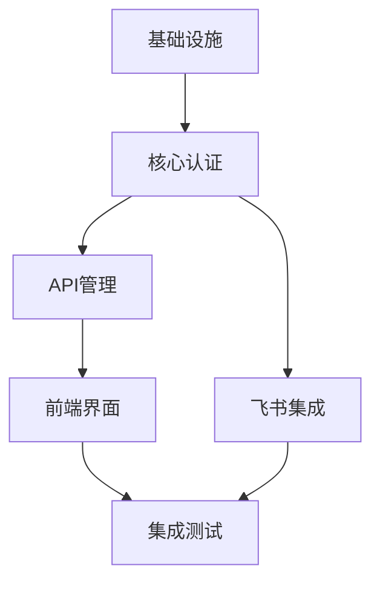
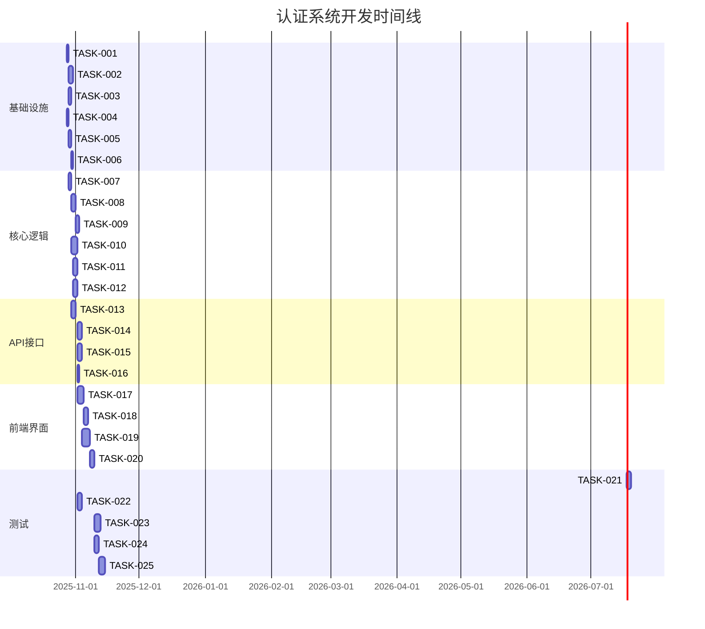

# 任务文档 - 认证与 API 密钥管理系统

## 基本信息

**规范名称**: 20251028-01-auth-system
**功能描述**: 认证与 API 密钥管理系统
**创建日期**: 2025-10-28
**版本**: 1.0
**负责人**: 开发团队

## 1. 任务概览

### 1.1 任务统计
- **总任务数**: 25个
- **开发任务**: 16个
- **测试任务**: 9个
- **预估工期**: 3-4周

### 1.2 依赖关系

## 2. 基础设施任务

### 2.1 数据库设置

- [ ] **TASK-001**: 初始化 Prisma ORM
  - **File**: `prisma/schema.prisma`
  - **Desc**: 安装依赖 (`prisma`, `@prisma/client`)，初始化 Prisma 配置
  - **Requirements**: 2.1, 2.2
  - **Leverage**: `package.json`, 现有的依赖管理
  - **Prompt**: Role: 后端开发者 | Task: 设置Prisma ORM，创建基础配置文件 | Restrictions: 必须配置MySQL连接，确保类型安全 | Success: Prisma初始化完成，能够连接数据库

- [ ] **TASK-002**: 创建数据库模型和迁移
  - **File**: `prisma/migrations/`
  - **Desc**: 根据设计文档创建User, UserIdentity, ApiKey等模型，执行数据库迁移
  - **Requirements**: 2.1-2.4
  - **Leverage**: 设计文档中的数据模型定义
  - **Prompt**: Role: 数据库开发者 | Task: 创建完整的数据库模式，包含所有表、索引和关系 | Restrictions: 必须包含所有必需的字段和约束，确保数据完整性 | Success: 数据库迁移成功执行，所有表创建正确

- [ ] **TASK-003**: 配置环境变量和数据库连接
  - **File**: `.env`, `src/config/database.ts`
  - **Desc**: 设置数据库连接字符串，配置连接池，创建数据库连接模块
  - **Requirements**: 4.1, 4.2
  - **Leverage**: 现有的配置管理方式
  - **Prompt**: Role: DevOps工程师 | Task: 配置数据库连接，设置环境变量管理 | Restrictions: 必须使用环境变量存储敏感信息，配置连接池优化性能 | Success: 数据库连接稳定，连接池配置合理

### 2.2 安全组件设置

- [ ] **TASK-004**: 配置密码哈希库
  - **File**: `src/utils/hash.ts`
  - **Desc**: 安装并配置bcrypt，创建密码和API密钥哈希工具函数
  - **Requirements**: 2.2, 3.2
  - **Leverage**: Node.js crypto模块
  - **Prompt**: Role: 安全工程师 | Task: 实现安全的哈希函数，支持salt rounds配置 | Restrictions: 必须使用bcrypt，salt rounds >= 12，支持恒定时间比较 | Success: 哈希函数安全可靠，性能符合要求

- [ ] **TASK-005**: 配置Session管理
  - **File**: `src/middleware/session.ts`
  - **Desc**: 安装并配置@fastify/session和@fastify/cookie，设置安全的session配置
  - **Requirements**: 2.1, 3.2
  - **Leverage**: Fastify框架
  - **Prompt**: Role: 后端开发者 | Task: 配置安全的session管理，包含cookie安全设置 | Restrictions: 必须设置HttpOnly, Secure, SameSite，使用强密钥 | Success: Session配置安全，支持分布式部署

- [ ] **TASK-006**: 设置缓存系统
  - **File**: `src/utils/cache.ts`
  - **Desc**: 配置lru-cache，实现API密钥和配额的内存缓存
  - **Requirements**: 6.1, 6.2
  - **Leverage**: Node.js缓存最佳实践
  - **Prompt**: Role: 后端开发者 | Task: 实现高效的缓存系统，支持TTL和容量限制 | Restrictions: 必须支持LRU淘汰，配置合理的TTL和容量 | Success: 缓存性能良好，命中率符合预期

## 3. 核心认证逻辑

### 3.1 API密钥管理

- [ ] **TASK-007**: 实现API密钥生成
  - **File**: `src/auth/apiKey.ts`
  - **Desc**: 实现高熵API密钥生成算法，包含前缀提取
  - **Requirements**: 2.3.1
  - **Leverage**: crypto.randomBytes
  - **Prompt**: Role: 安全工程师 | Task: 实现安全的API密钥生成算法，确保唯一性和高熵 | Restrictions: 必须使用加密安全的随机数生成器，包含'sk-'前缀 | Success: 密钥生成安全可靠，格式符合规范

- [ ] **TASK-008**: 实现API密钥验证
  - **File**: `src/auth/apiKey.ts`
  - **Desc**: 实现API密钥验证逻辑，包含前缀匹配和哈希比较
  - **Requirements**: 2.2.1, 2.2.2
  - **Leverage**: TASK-004的哈希函数
  - **Prompt**: Role: 安全工程师 | Task: 实现安全的API密钥验证，防止时序攻击 | Restrictions: 必须使用恒定时间比较，支持缓存查询 | Success: 验证逻辑安全高效，性能符合要求

- [ ] **TASK-009**: 重构认证中间件
  - **File**: `src/middleware/auth.ts`
  - **Desc**: 重构现有认证中间件，集成新的API密钥验证逻辑
  - **Requirements**: 2.2.1, 2.2.2
  - **Leverage**: 现有的auth.ts, TASK-008
  - **Prompt**: Role: 后端开发者 | Task: 重构认证中间件，保持向后兼容的同时支持新的认证方式 | Restrictions: 必须保留现有功能直到完全迁移，错误处理清晰 | Success: 认证中间件功能完整，性能良好

### 3.2 用户认证

- [ ] **TASK-010**: 实现飞书OAuth流程
  - **File**: `src/auth/feishu.ts`, `src/routes/auth.ts`
  - **Desc**: 实现完整的飞书OAuth登录流程，包含授权、回调、用户创建
  - **Requirements**: 2.1.1, 2.1.2
  - **Leverage**: 飞书开放平台API
  - **Prompt**: Role: 后端开发者 | Task: 实现飞书OAuth集成，处理完整的认证流程 | Restrictions: 必须验证state参数防止CSRF，正确处理错误场景 | Success: OAuth流程稳定可靠，用户体验良好

- [ ] **TASK-011**: 实现用户服务
  - **File**: `src/services/userService.ts`
  - **Desc**: 实现用户相关业务逻辑，包含用户创建、查询、更新
  - **Requirements**: 2.1, 2.4
  - **Leverage**: Prisma模型
  - **Prompt**: Role: 后端开发者 | Task: 实现用户业务逻辑，支持用户身份管理和权限控制 | Restrictions: 必须确保数据一致性，支持事务处理 | Success: 用户服务功能完整，性能稳定

- [ ] **TASK-012**: 实现配额检查
  - **File**: `src/services/quotaService.ts`
  - **Desc**: 实现用户和API密钥配额检查逻辑
  - **Requirements**: 2.3.4
  - **Leverage**: 缓存系统, 数据库查询
  - **Prompt**: Role: 后端开发者 | Task: 实现配额限制逻辑，支持滑动窗口计数 | Restrictions: 必须支持高并发访问，配额计算准确 | Success: 配额检查准确高效，支持多种配额规则

## 4. API接口实现

### 4.1 API密钥管理接口

- [ ] **TASK-013**: 实现创建API密钥接口
  - **File**: `src/routes/apiKeys.ts`
  - **Desc**: 实现POST /api/keys接口，创建新API密钥
  - **Requirements**: 2.3.1
  - **Leverage**: TASK-007, 用户认证中间件
  - **Prompt**: Role: 后端开发者 | Task: 实现API密钥创建接口，确保安全返回密钥 | Restrictions: 必须验证用户身份，密钥只返回一次，支持名称设置 | Success: 接口功能完整，安全性符合要求

- [ ] **TASK-014**: 实现查询API密钥接口
  - **File**: `src/routes/apiKeys.ts`
  - **Desc**: 实现GET /api/keys接口，查询用户的API密钥列表
  - **Requirements**: 2.3.2
  - **Leverage**: 用户认证中间件
  - **Prompt**: Role: 后端开发者 | Task: 实现API密钥列表查询，支持分页和过滤 | Restrictions: 不能返回密钥哈希或完整密钥，只返回元数据 | Success: 接口性能良好，数据安全

- [ ] **TASK-015**: 实现更新API密钥接口
  - **File**: `src/routes/apiKeys.ts`
  - **Desc**: 实现PUT /api/keys/{keyId}接口，更新密钥名称和状态
  - **Requirements**: 2.3.3
  - **Leverage**: 用户认证中间件
  - **Prompt**: Role: 后端开发者 | Task: 实现API密钥更新接口，支持名称和状态修改 | Restrictions: 必须验证密钥归属，支持原子操作，缓存失效 | Success: 接口功能正确，权限控制严格

- [ ] **TASK-016**: 实现删除API密钥接口
  - **File**: `src/routes/apiKeys.ts`
  - **Desc**: 实现DELETE /api/keys/{keyId}接口，删除API密钥
  - **Requirements**: 2.3.3
  - **Leverage**: 用户认证中间件
  - **Prompt**: Role: 后端开发者 | Task: 实现API密钥删除接口，支持软删除和物理删除 | Restrictions: 必须验证密钥归属，清理关联数据，事务安全 | Success: 删除操作安全可靠，数据完整性保证

## 5. 前端界面开发

### 5.1 认证界面

- [ ] **TASK-017**: 创建登录页面
  - **File**: `src/pages/LoginPage.tsx`
  - **Desc**: 创建飞书登录页面，包含登录按钮和加载状态
  - **Requirements**: 2.1.1
  - **Leverage**: React, 现有的UI组件库
  - **Prompt**: Role: 前端开发者 | Task: 创建用户友好的登录界面，集成飞书OAuth | Restrictions: 必须处理登录状态，显示错误信息，支持重定向 | Success: 登录页面美观易用，流程顺畅

- [ ] **TASK-018**: 实现路由保护
  - **File**: `src/components/ProtectedRoute.tsx`
  - **Desc**: 实现基于认证状态的路由保护组件
  - **Requirements**: 2.1.1, 2.1.2
  - **Leverage**: React Router, 认证状态管理
  - **Prompt**: Role: 前端开发者 | Task: 实现路由保护逻辑，确保未认证用户重定向到登录页 | Restrictions: 必须正确处理认证状态，支持角色权限控制 | Success: 路由保护功能正常，用户体验良好

### 5.2 API密钥管理界面

- [ ] **TASK-019**: 创建API密钥管理页面
  - **File**: `src/pages/ApiKeyManagementPage.tsx`
  - **Desc**: 创建API密钥列表展示页面，支持查看、编辑、删除操作
  - **Requirements**: 2.3.2, 2.3.3
  - **Leverage**: React, 表格组件, 现有的UI框架
  - **Prompt**: Role: 前端开发者 | Task: 创建功能完整的API密钥管理界面，支持CRUD操作 | Restrictions: 必须分页显示，支持搜索和过滤，操作确认机制 | Success: 界面功能完整，用户操作便捷

- [ ] **TASK-020**: 实现创建API密钥弹窗
  - **File**: `src/components/CreateApiKeyModal.tsx`
  - **Desc**: 实现创建API密钥的弹窗组件，显示生成的密钥
  - **Requirements**: 2.3.1
  - **Leverage**: React, 弹窗组件
  - **Prompt**: Role: 前端开发者 | Task: 实现创建密钥弹窗，安全显示生成的密钥 | Restrictions: 必须只显示一次密钥，提供复制功能，安全提示 | Success: 创建流程顺畅，密钥安全显示

## 6. 测试任务

### 6.1 单元测试

- [ ] **TASK-021**: API密钥功能单元测试
  - **File**: `tests/unit/apiKey.test.ts`
  - **Desc**: 测试API密钥生成、哈希、验证逻辑
  - **Requirements**: 2.2, 2.3
  - **Leverage**: Jest, 测试框架
  - **Prompt**: Role: 测试工程师 | Task: 编写API密钥相关功能的单元测试，覆盖所有边界情况 | Restrictions: 必须测试密钥格式、哈希正确性、验证准确性，达到100%覆盖率 | Success: 测试覆盖完整，功能验证正确

- [ ] **TASK-022**: 用户服务单元测试
  - **File**: `tests/unit/userService.test.ts`
  - **Desc**: 测试用户相关业务逻辑
  - **Requirements**: 2.1, 2.4
  - **Leverage**: Jest, 数据库mock
  - **Prompt**: Role: 测试工程师 | Task: 编写用户服务单元测试，包含用户创建、查询、权限检查 | Restrictions: 必须mock数据库，测试所有业务逻辑分支，异常处理 | Success: 测试覆盖全面，业务逻辑正确

### 6.2 集成测试

- [ ] **TASK-023**: 认证流程集成测试
  - **File**: `tests/integration/auth.test.ts`
  - **Desc**: 测试完整的认证流程，包含OAuth和API密钥认证
  - **Requirements**: 2.1, 2.2
  - **Leverage**: Supertest, 测试数据库
  - **Prompt**: Role: 测试工程师 | Task: 编写认证流程的集成测试，模拟真实用户场景 | Restrictions: 必须测试登录、登出、API调用认证，错误处理 | Success: 集成测试稳定，流程验证正确

- [ ] **TASK-024**: API接口集成测试
  - **File**: `tests/integration/apiKeys.test.ts`
  - **Desc**: 测试API密钥管理接口
  - **Requirements**: 2.3
  - **Leverage**: Supertest, 认证中间件
  - **Prompt**: Role: 测试工程师 | Task: 编写API接口集成测试，验证CRUD操作和权限控制 | Restrictions: 必须测试所有接口，权限验证，数据验证 | Success: 接口测试完整，功能验证正确

### 6.3 端到端测试

- [ ] **TASK-025**: 完整流程E2E测试
  - **File**: `tests/e2e/auth-flow.test.ts`
  - **Desc**: 测试用户登录到API密钥管理的完整流程
  - **Requirements**: 2.1-2.4
  - **Leverage**: Playwright, 测试环境
  - **Prompt**: Role: 测试工程师 | Task: 编写端到端测试，验证用户完整使用流程 | Restrictions: 必须模拟真实用户操作，验证所有关键功能，性能测试 | Success: E2E测试稳定，用户体验验证正确

## 7. 任务依赖关系

### 7.1 关键路径

### 7.2 并行任务组

**第一组（可并行）**: TASK-001, TASK-004, TASK-007
**第二组（可并行）**: TASK-003, TASK-005, TASK-006
**第三组（可并行）**: TASK-011, TASK-012, TASK-014
**第四组（可并行）**: TASK-021, TASK-022, TASK-023

## 8. 质量保证

### 8.1 代码审查检查点

- **基础设施完成后**: TASK-001到TASK-006
- **核心逻辑完成后**: TASK-007到TASK-012
- **API接口完成后**: TASK-013到TASK-016
- **前端界面完成后**: TASK-017到TASK-020

### 8.2 测试覆盖率要求

- **单元测试覆盖率**: ≥ 90%
- **集成测试覆盖率**: ≥ 80%
- **关键路径覆盖率**: 100%

### 8.3 性能基准

- **API密钥验证延迟**: P99 < 50ms
- **登录处理延迟**: P99 < 500ms
- **API密钥列表查询**: < 200ms
- **并发处理能力**: 1000+ req/s

## 9. 风险控制

### 9.1 技术风险

- **数据库迁移风险**: 准备回滚脚本，分阶段迁移
- **性能风险**: 提前进行性能测试，优化慢查询
- **安全风险**: 安全代码审查，渗透测试

### 9.2 进度风险

- **依赖延迟**: 准备备选方案，调整任务优先级
- **资源不足**: 任务优先级排序，关键路径保证
- **质量问题**: 增加代码审查频率，自动化测试

## 10. 验收标准

### 10.1 功能验收

- ✅ 用户可以通过飞书成功登录
- ✅ 用户可以创建、查看、编辑、删除API密钥
- ✅ API请求通过密钥正确认证
- ✅ 配额限制正确执行
- ✅ 权限控制有效

### 10.2 性能验收

- ✅ 认证延迟P99 < 50ms
- ✅ 登录处理P99 < 500ms
- ✅ 系统可用性 > 99.9%
- ✅ 并发处理能力达标

### 10.3 安全验收

- ✅ 密钥安全存储和传输
- ✅ 权限控制严格执行
- ✅ 安全漏洞扫描通过
- ✅ 渗透测试通过

## 11. 部署清单

### 11.1 部署前检查

- [ ] 所有测试通过
- [ ] 性能测试完成
- [ ] 安全审查完成
- [ ] 文档更新完成
- [ ] 监控配置完成

### 11.2 部署步骤

1. 备份现有数据
2. 执行数据库迁移
3. 部署新代码
4. 验证功能正常
5. 监控系统状态
6. 通知相关人员

### 11.3 部署后验证

- [ ] 功能验证
- [ ] 性能验证
- [ ] 安全验证
- [ ] 用户反馈收集