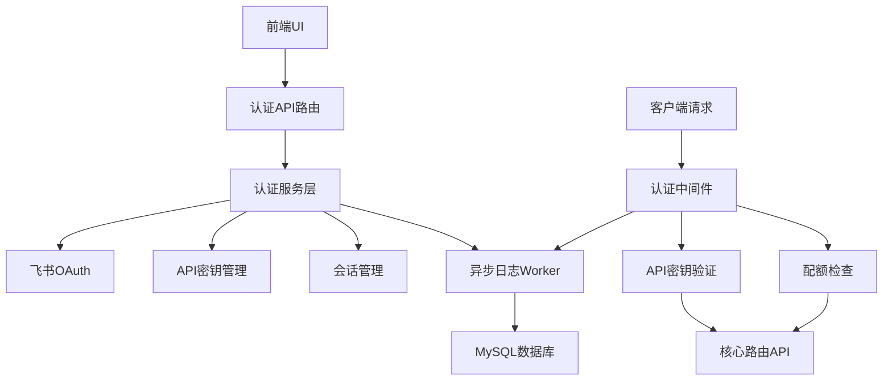

# 设计文档

## 概述

本文档详细描述了 `claude-code-router` 用户认证（基于飞书 OAuth）、API 密钥认证以及 API 密钥管理功能的技术设计方案。该设计实现了一个安全的、基于角色的访问控制系统，允许用户通过飞书登录并管理自己的 API 密钥以访问路由服务。

## 指导文档对齐

### 技术标准 (tech.md)

本设计严格遵循 tech.md 中定义的技术栈选择：

- **数据库**: 使用 MySQL 进行用户、API密钥和配额数据的持久化存储
- **ORM/Query Builder**: 采用 Prisma 提供类型安全的数据库交互
- **后端框架**: 基于 Fastify 构建高性能的认证和API服务
- **异步日志**: 使用 Node.js Worker Threads 实现非阻塞的日志记录
- **API Key 哈希**: 采用 bcrypt 进行安全的密钥哈希存储
- **UI 认证状态**: 使用 Fastify Session 进行会话管理
- **缓存**: 使用 `lru-cache` 实现内存缓存以提升性能

### 项目结构 (structure.md)

实现遵循 structure.md 中定义的目录结构：

- **`src/auth/`**: 包含飞书OAuth、API密钥生成和验证逻辑
- **`src/middleware/`**: 实现认证和配额检查的Fastify钩子
- **`src/services/`**: 封装配额检查、API密钥管理等业务逻辑
- **`src/db/`**: 使用Prisma客户端进行数据库交互
- **`src/api/`**: 实现认证相关的API端点

## 代码重用分析

### 要利用的现有组件

- **Fastify Framework**: 现有的 Fastify 服务器实例将用于注册认证中间件和路由
- **@musistudio/llms**: 现有的路由系统将集成认证中间件来保护核心API端点
- **Configuration System**: 现有的配置加载机制将扩展以支持认证相关的配置项

### 集成点

- **Core Routing API**: 认证中间件将保护 `/v1/messages` 等核心端点
- **Database Schema**: 将扩展现有数据库模式以添加用户、API密钥和配额表
- **UI Application**: React前端将与新的认证API端点集成
- **Logging System**: 异步日志Worker将集成到认证流程中记录请求

## 架构

设计采用模块化的认证架构，包含三个主要层次：

1. **认证层**: 处理用户登录（飞书OAuth）和API密钥验证
2. **授权层**: 管理用户角色和权限检查
3. **业务逻辑层**: 处理配额管理、API密钥管理等核心功能

### 模块化设计原则

- **单一文件职责**: 认证、授权、配额管理分别位于独立模块
- **组件隔离**: OAuth流程、API密钥验证、配额检查实现为独立组件
- **服务层分离**: 数据访问（Prisma）、业务逻辑（Services）、API处理（Routes）清晰分离
- **工具模块化**: 密钥生成、哈希、验证等工具函数独立模块化



## 组件和接口

### 组件1: 飞书OAuth服务 (`src/auth/feishu.ts`)

- **目的:** 处理飞书OAuth登录流程，包括授权请求、回调处理和用户信息同步
- **接口:**
  - `generateAuthUrl(): Promise<string>` - 生成飞书授权URL
  - `handleCallback(code: string, state: string): Promise<User>` - 处理OAuth回调
  - `syncUserInfo(feishuUserId: string): Promise<User>` - 同步用户信息
- **依赖:** Fastify Session, HTTP Client (for Feishu API)
- **重用:** 现有的配置系统获取飞书应用凭证

### 组件2: API密钥服务 (`src/auth/apiKey.ts`)

- **目的:** 管理API密钥的生成、哈希、验证和生命周期
- **接口:**
  - `generateApiKey(): Promise<string>` - 生成新的API密钥
  - `hashApiKey(key: string): Promise<string>` - 哈希API密钥
  - `validateApiKey(key: string): Promise<ApiKeyValidationResult>` - 验证API密钥
  - `createApiKey(userId: string, name?: string): Promise<ApiKey>` - 创建新密钥
- **依赖:** bcrypt, crypto module
- **重用:** 现有的缓存系统进行密钥验证优化

### 组件3: 配额服务 (`src/services/quotaService.ts`)

- **目的:** 检查和管理用户及API密钥的请求配额
- **接口:**
  - `checkUserQuota(userId: string): Promise<QuotaResult>` - 检查用户配额
  - `checkApiKeyQuota(apiKeyId: string): Promise<QuotaResult>` - 检查API密钥配额
  - `recordQuotaCheck(result: QuotaResult): Promise<void>` - 记录配额检查结果
- **依赖:** Prisma Client, Cache system
- **重用:** 现有的数据库连接和缓存基础设施

### 组件4: 认证中间件 (`src/middleware/auth.ts`)

- **目的:** Fastify钩子，拦截请求并执行API密钥验证和配额检查
- **接口:** Fastify preHandler hook implementation
- **依赖:** API Key Service, Quota Service, Cache
- **重用:** 现有的Fastify实例和路由注册机制

## 数据模型

### 用户模型

```typescript
interface User {
  id: string              // UUID 主键
  name: string           // 飞书用户显示名称
  avatar_url?: string    // 头像URL
  is_active: boolean     // 账户状态
  is_admin: boolean      // 管理员权限
  created_at: Date       // 账户创建时间戳
  updated_at: Date       // 最后更新时间戳
}
```

### 用户身份模型

```typescript
interface UserIdentity {
  id: string             // UUID 主键
  user_id: string        // users表外键
  provider: string       // 认证提供方 ('feishu')
  provider_user_id: string // 提供方用户标识符
  created_at: Date       // 身份创建时间戳
  updated_at: Date       // 最后更新时间戳
}
```

### API密钥模型

```typescript
interface ApiKey {
  id: string             // UUID 主键
  user_id: string        // users表外键
  name?: string          // 用户定义的密钥名称
  key_hash: string       // API密钥的bcrypt哈希
  key_prefix: string     // 用于缓存查找的前几位字符
  is_active: boolean     // 密钥状态
  last_used_at?: Date    // 最后成功使用时间戳
  created_at: Date       // 密钥创建时间戳
  updated_at: Date       // 最后更新时间戳
}
```

### 用户配额模型

```typescript
interface UserQuota {
  id: string             // UUID 主键
  user_id: string        // users表外键
  limit: number          // 每时间窗口最大请求数
  interval_minutes: number // 时间窗口（分钟）
  created_at: Date       // 配额创建时间戳
  updated_at: Date       // 最后更新时间戳
}
```

### API密钥配额模型

```typescript
interface ApiKeyQuota {
  id: string             // UUID 主键
  api_key_id: string     // api_keys表外键
  limit: number          // 每时间窗口最大请求数
  interval_minutes: number // 时间窗口（分钟）
  created_at: Date       // 配额创建时间戳
  updated_at: Date       // 最后更新时间戳
}
```

### 请求日志模型

```typescript
interface RequestLog {
  id: string             // UUID 主键
  user_id: string        // users表外键
  api_key_id?: string    // api_keys表外键（可选）
  endpoint: string       // 访问的API端点
  method: string         // HTTP方法
  status: 'success' | 'error' | 'quota_exceeded' // 请求结果
  response_time_ms: number // 请求处理时间
  request_timestamp: Date // 请求时间戳
  error_message?: string // 错误详情（如适用）
}
```

## 错误处理

### 错误场景

1. **无效API密钥格式:**
   - **处理:** 返回401 Unauthorized并提供通用错误消息
   - **用户影响:** 客户端收到清晰的认证失败信息，不暴露系统细节

2. **API密钥未找到或已禁用:**
   - **处理:** 返回401 Unauthorized，可选择记录尝试用于安全监控
   - **用户影响:** 用户必须提供有效的API密钥才能访问服务

3. **配额超限:**
   - **处理:** 返回429 Too Many Requests并包含Retry-After头
   - **用户影响:** 客户端收到限流信息，可在指定时间后重试

4. **飞书OAuth失败:**
   - **处理:** 重定向到登录页面并附带错误参数，显示用户友好消息
   - **用户影响:** 用户看到登录失败的清晰说明并可重试

5. **数据库连接问题:**
   - **处理:** 实施断路器模式，返回503 Service Unavailable
   - **用户影响:** 用户收到临时服务不可用消息

6. **会话篡改:**
   - **处理:** 清除会话，重定向到登录，记录安全事件
   - **用户影响:** 用户必须重新认证，系统保持安全

## 测试策略

### 单元测试

- **API密钥生成和验证:** 测试密钥生成熵、哈希正确性和验证逻辑
- **配额检查逻辑:** 测试配额计算、时间窗口处理和边缘情况
- **OAuth服务函数:** 测试URL生成、令牌交换和用户信息解析
- **哈希函数:** 测试bcrypt集成和恒定时间比较
- **配置加载:** 测试认证配置解析和验证

### 集成测试

- **完整OAuth流程:** 模拟飞书API测试完整登录重定向和回调流程
- **API密钥认证流程:** 测试中间件集成以及有效/无效密钥的处理
- **配额强制执行:** 测试各种请求模式和限制下的配额检查
- **数据库操作:** 测试用户/身份/API密钥的创建、更新和关系
- **异步日志:** 测试主线程到工作线程的通信和数据库持久化

### 端到端测试

- **用户登录/登出:** 在浏览器环境中测试完整的飞书认证流程
- **API密钥管理:** 通过UI测试密钥的创建、列表、启用/禁用和删除
- **配额配置:** 通过管理界面测试设置和修改配额
- **请求历史:** 测试请求日志的查看和过滤
- **安全场景:** 测试CSRF保护、会话劫挟防护和权限提升

## 原始文档的附加内容

### 核心认证流程 (API密钥)

1. **提取密钥**: 从请求头获取API密钥，如果缺失返回401
2. **基本校验**: 检查密钥格式（如以`sk-`开头，长度符合要求）
3. **提取前缀**: 获取密钥前缀用于缓存查询
4. **缓存查询**: 根据前缀从内存缓存查找可能的密钥列表
5. **数据库查询**: 缓存未命中时查询数据库获取密钥记录
6. **哈希比较**: 使用bcrypt.compare进行恒定时间比较验证
7. **用户信息查询**: 获取用户信息和状态检查
8. **配额检查**: 检查用户级和API密钥级配额限制
9. **附加信息**: 将用户信息附加到请求对象
10. **更新使用时间**: 异步更新last_used_at字段
11. **继续处理**: 调用done()继续请求处理

### API接口设计

**UI认证端点:**

- `GET /auth/feishu`: 重定向到飞书授权页面
- `GET /auth/feishu/callback`: 处理飞书OAuth回调
- `POST /auth/logout`: 用户登出

**API密钥管理端点:**

- `GET /api/me`: 获取当前用户信息
- `GET /api/keys`: 获取用户的API密钥列表
- `POST /api/keys`: 创建新API密钥
- `PUT /api/keys/{keyId}`: 更新密钥信息
- `DELETE /api/keys/{keyId}`: 删除API密钥
- `PUT /api/keys/{keyId}/quota`: 设置密钥配额
- `DELETE /api/keys/{keyId}/quota`: 移除密钥配额

**受保护的核心路由:**

- `POST /v1/messages`: 需要API密钥认证的核心消息路由
- `GET /v1/models`: 列出可用模型（如需要）

**历史记录端点:**

- `GET /api/history`: 获取用户请求历史（支持分页和过滤）

**管理员端点:**

- `GET /admin/users`: 获取用户列表
- `PUT /admin/users/{userId}/quota`: 设置用户配额
- `PUT /admin/users/{userId}/status`: 启用/禁用用户
