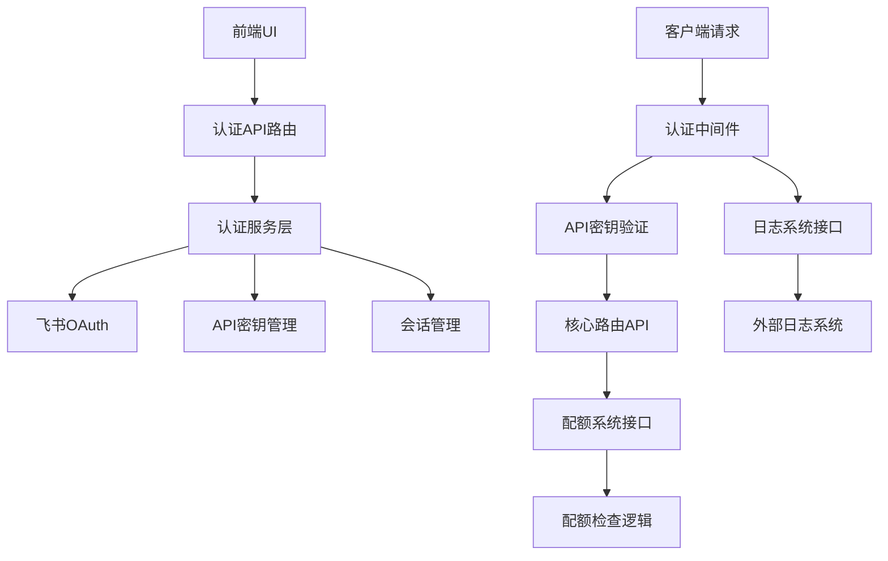
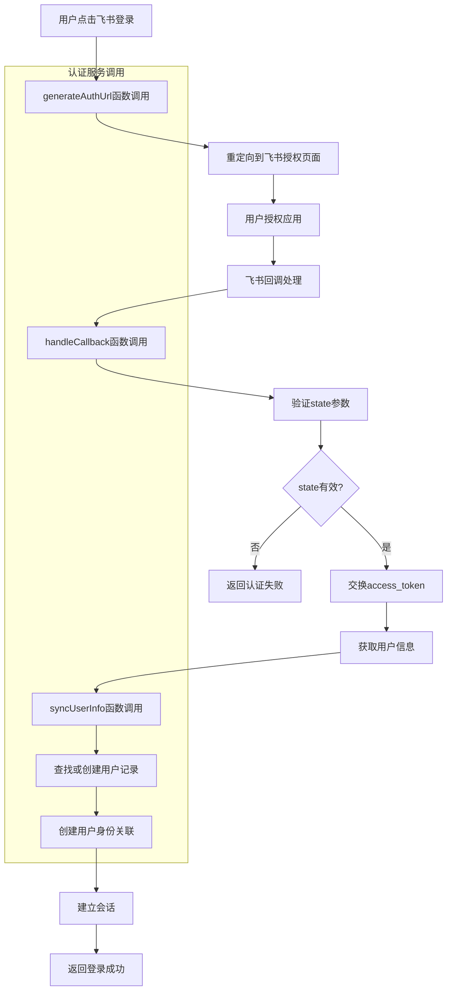
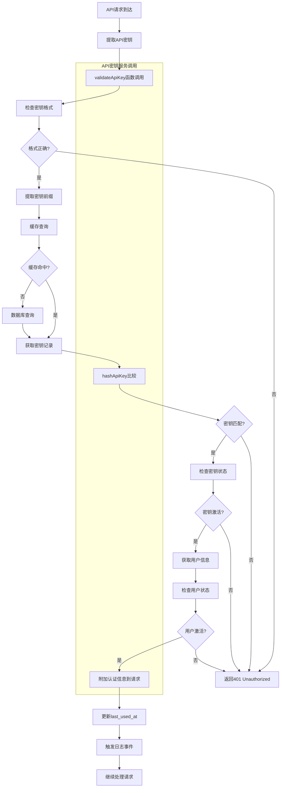
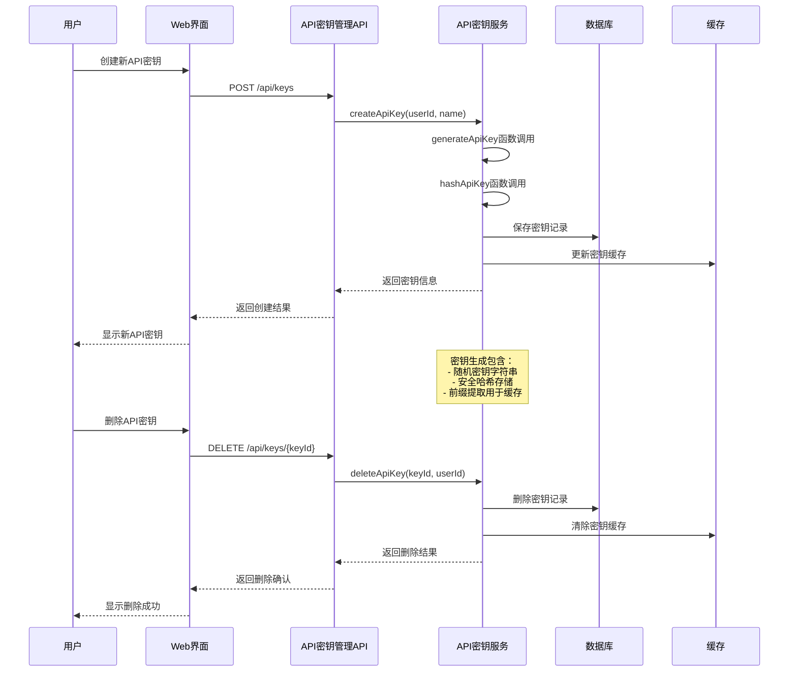

# Design Document

## Overview

本文档详细描述了 `claude-code-router` 用户认证（基于飞书 OAuth）、API 密钥认证以及 API 密钥管理功能的技术设计方案。该设计实现了一个安全的身份验证系统，允许用户通过飞书登录并管理自己的 API 密钥以访问路由服务。认证系统专注于身份验证和授权管理，为其他系统（如配额管理、日志记录）提供必要的用户身份信息支持。

## Steering Document Alignment

### Technical Standards (tech.md)

本设计严格遵循 tech.md 中定义的技术栈选择：

- **数据库**: 使用 MySQL 进行用户和API密钥数据的持久化存储
- **ORM/Query Builder**: 采用 Prisma 提供类型安全的数据库交互
- **后端框架**: 基于 Fastify 构建高性能的认证和API服务
- **API Key 哈希**: 采用 bcrypt 进行安全的密钥哈希存储
- **UI 认证状态**: 使用 Fastify Session 进行会话管理
- **缓存**: 使用 `lru-cache` 实现内存缓存以提升性能

### Project Structure (structure.md)

实现遵循 structure.md 中定义的目录结构：

- **`src/auth/`**: 包含飞书OAuth、API密钥生成和验证逻辑
- **`src/middleware/`**: 实现API密钥认证的Fastify钩子
- **`src/services/`**: 封装API密钥管理、用户身份验证等业务逻辑
- **`src/db/`**: 使用Prisma客户端进行数据库交互
- **`src/api/`**: 实现认证相关的API端点

## Code Reuse Analysis

### Existing Components to Leverage

- **Fastify Framework**: 现有的 Fastify 服务器实例将用于注册认证中间件和路由
- **@musistudio/llms**: 现有的路由系统将集成认证中间件来保护核心API端点
- **Configuration System**: 现有的配置加载机制将扩展以支持认证相关的配置项

### Integration Points

- **Core Routing API**: 认证中间件将保护 `/v1/messages` 等核心端点
- **Database Schema**: 将扩展现有数据库模式以添加用户、API密钥表
- **UI Application**: React前端将与新的认证API端点集成
- **Quota System**: 认证系统为配额系统提供用户身份信息，配额检查由配额系统独立处理
- **Logging System**: 认证系统提供接口供日志系统记录认证相关事件

## Architecture

设计采用模块化的认证架构，包含两个主要层次：

1. **认证层**: 处理用户登录（飞书OAuth）和API密钥验证
2. **授权层**: 管理用户角色和权限检查

认证系统专注于身份验证，为配额系统提供用户身份信息，但不处理配额逻辑。

### Modular Design Principles

- **Single File Responsibility**: 认证、授权分别位于独立模块，配额管理由独立配额系统处理
- **Component Isolation**: OAuth流程、API密钥验证实现为独立组件
- **Service Layer Separation**: 数据访问（Prisma）、业务逻辑（Services）、API处理（Routes）清晰分离
- **Utility Modularity**: 密钥生成、哈希、验证等工具函数独立模块化



## Components and Interfaces

### Component 1: 飞书OAuth服务 (`src/auth/feishu.ts`)

- **Purpose:** 处理飞书OAuth登录流程，包括授权请求、回调处理和用户信息同步
- **Interfaces:**
  - `generateAuthUrl(): Promise<string>` - 生成飞书授权URL
  - `handleCallback(code: string, state: string): Promise<User>` - 处理OAuth回调
  - `syncUserInfo(feishuUserId: string): Promise<User>` - 同步用户信息
- **Dependencies:** Fastify Session, HTTP Client (for Feishu API)
- **Reuses:** 现有的配置系统获取飞书应用凭证

### Component 2: API密钥服务 (`src/auth/apiKey.ts`)

- **Purpose:** 管理API密钥的生成、哈希、验证和生命周期
- **Interfaces:**
  - `generateApiKey(): Promise<string>` - 生成新的API密钥
  - `hashApiKey(key: string): Promise<string>` - 哈希API密钥
  - `validateApiKey(key: string): Promise<ApiKeyValidationResult>` - 验证API密钥
  - `createApiKey(userId: string, name?: string): Promise<ApiKey>` - 创建新密钥
- **Dependencies:** bcrypt, crypto module
- **Reuses:** 现有的缓存系统进行密钥验证优化

### Component 3: 认证中间件 (`src/middleware/auth.ts`)

- **Purpose:** Fastify钩子，拦截请求并执行API密钥验证，为配额系统提供用户身份信息
- **Interfaces:** Fastify preHandler hook implementation
- **Dependencies:** API Key Service, Cache
- **Reuses:** 现有的Fastify实例和路由注册机制

## Data Models

### Model 1: User

```typescript
interface User {
  id: string              // UUID 主键
  name: string           // 飞书用户显示名称
  avatar_url?: string    // 头像URL
  is_active: boolean     // 账户状态
  is_admin: boolean      // 管理员权限
  created_at: Date       // 账户创建时间戳
  updated_at: Date       // 最后更新时间戳
}
```

### Model 2: UserIdentity

```typescript
interface UserIdentity {
  id: string             // UUID 主键
  user_id: string        // users表外键
  provider: string       // 认证提供方 ('feishu')
  provider_user_id: string // 提供方用户标识符
  created_at: Date       // 身份创建时间戳
  updated_at: Date       // 最后更新时间戳
}
```

### Model 3: ApiKey

```typescript
interface ApiKey {
  id: string             // UUID 主键
  user_id: string        // users表外键
  name?: string          // 用户定义的密钥名称
  key_hash: string       // API密钥的bcrypt哈希
  key_prefix: string     // 用于缓存查找的前几位字符
  is_active: boolean     // 密钥状态
  last_used_at?: Date    // 最后成功使用时间戳
  created_at: Date       // 密钥创建时间戳
  updated_at: Date       // 最后更新时间戳
}
```

## Business Process

### Process 1: 飞书OAuth认证流程



### Process 2: API密钥认证流程



### Process 3: API密钥管理流程



## Error Handling

### Error Scenarios

1. **无效API密钥格式:**
   - **Handling:** 返回401 Unauthorized并提供通用错误消息
   - **User Impact:** 客户端收到清晰的认证失败信息，不暴露系统细节

2. **API密钥未找到或已禁用:**
   - **Handling:** 返回401 Unauthorized，可选择记录尝试用于安全监控
   - **User Impact:** 用户必须提供有效的API密钥才能访问服务

3. **飞书OAuth失败:**
   - **Handling:** 重定向到登录页面并附带错误参数，显示用户友好消息
   - **User Impact:** 用户看到登录失败的清晰说明并可重试

4. **数据库连接问题:**
   - **Handling:** 实施断路器模式，返回503 Service Unavailable
   - **User Impact:** 用户收到临时服务不可用消息

5. **会话篡改:**
   - **Handling:** 清除会话，重定向到登录，记录安全事件
   - **User Impact:** 用户必须重新认证，系统保持安全

6. **用户账户已禁用:**
   - **Handling:** 返回403 Forbidden，记录拒绝访问事件
   - **User Impact:** 用户需要联系管理员启用账户

## Testing Strategy

### Unit Testing

- **API密钥生成和验证:** 测试密钥生成熵、哈希正确性和验证逻辑
- **OAuth服务函数:** 测试URL生成、令牌交换和用户信息解析
- **哈希函数:** 测试bcrypt集成和恒定时间比较
- **配置加载:** 测试认证配置解析和验证
- **会话管理:** 测试会话创建、验证和清理逻辑

### Integration Testing

- **完整OAuth流程:** 模拟飞书API测试完整登录重定向和回调流程
- **API密钥认证流程:** 测试中间件集成以及有效/无效密钥的处理
- **数据库操作:** 测试用户/身份/API密钥的创建、更新和关系
- **缓存集成:** 测试API密钥缓存的命中和失效机制
- **日志系统接口:** 测试认证系统向日志系统提供事件数据的接口

### End-to-End Testing

- **用户登录/登出:** 在浏览器环境中测试完整的飞书认证流程
- **API密钥管理:** 通过UI测试密钥的创建、列表、启用/禁用和删除
- **安全场景:** 测试CSRF保护、会话劫挟防护和权限提升
- **配额系统集成:** 测试认证系统正确传递用户身份信息给配额系统
- **日志系统集成:** 测试认证事件正确传递给日志系统用于记录

## Appendix: 认证系统核心流程

### 核心API密钥认证流程

1. **提取密钥**: 从请求头获取API密钥，如果缺失返回401
2. **基本校验**: 检查密钥格式（如以`sk-`开头，长度符合要求）
3. **提取前缀**: 获取密钥前缀用于缓存查询
4. **缓存查询**: 根据前缀从内存缓存查找可能的密钥列表
5. **数据库查询**: 缓存未命中时查询数据库获取密钥记录
6. **哈希比较**: 使用bcrypt.compare进行恒定时间比较验证
7. **用户信息查询**: 获取用户信息和状态检查
8. **附加认证信息**: 将用户身份信息附加到请求对象供配额系统使用
9. **更新使用时间**: 异步更新last_used_at字段
10. **触发认证事件**: 向日志系统提供认证相关事件数据
11. **继续处理**: 调用done()继续请求处理，交由配额系统进行配额检查

### 认证系统设计优势

1. **职责分离**: 认证系统专注于身份验证，配额管理和日志记录完全独立
2. **安全性**: 使用bcrypt进行安全哈希，支持恒定时间比较
3. **性能优化**: 多层缓存机制减少数据库查询
4. **可扩展性**: 模块化设计便于添加新的认证方式
5. **事件驱动**: 通过事件接口与其他系统（日志、配额）解耦
6. **系统解耦**: 认证与其他系统通过标准接口通信，便于维护

### API接口设计

**UI认证端点:**

- `GET /auth/feishu`: 重定向到飞书授权页面
- `GET /auth/feishu/callback`: 处理飞书OAuth回调
- `POST /auth/logout`: 用户登出

**API密钥管理端点:**

- `GET /api/me`: 获取当前用户信息
- `GET /api/keys`: 获取用户的API密钥列表
- `POST /api/keys`: 创建新API密钥
- `PUT /api/keys/{keyId}`: 更新密钥信息（名称、状态）
- `DELETE /api/keys/{keyId}`: 删除API密钥

**受保护的核心路由:**

- `POST /v1/messages`: 需要API密钥认证的核心消息路由
- `GET /v1/models`: 列出可用模型（如需要）

**管理员端点:**

- `GET /admin/users`: 获取用户列表
- `PUT /admin/users/{userId}/status`: 启用/禁用用户
- `GET /admin/keys`: 获取所有API密钥列表
- `PUT /admin/keys/{keyId}/status`: 启用/禁用API密钥

### 与配额系统的接口设计

认证系统为配额系统提供标准接口：

```typescript
interface AuthResult {
  userId: string;
  apiKeyId?: string;
  userName: string;
  isActive: boolean;
  isAdmin: boolean;
}
```

### 与日志系统的接口设计

认证系统为日志系统提供认证事件接口：

```typescript
interface AuthEvent {
  type: 'auth_success' | 'auth_failed' | 'key_created' | 'key_deleted' | 'login' | 'logout';
  userId?: string;
  apiKeyId?: string;
  timestamp: Date;
  details: {
    userAgent?: string;
    ipAddress?: string;
    endpoint?: string;
    reason?: string;
  };
}
```

配额系统可以在认证中间件执行后获取AuthResult信息来进行配额检查，日志系统可以订阅AuthEvent进行审计记录，实现认证与其他系统的完全解耦。
