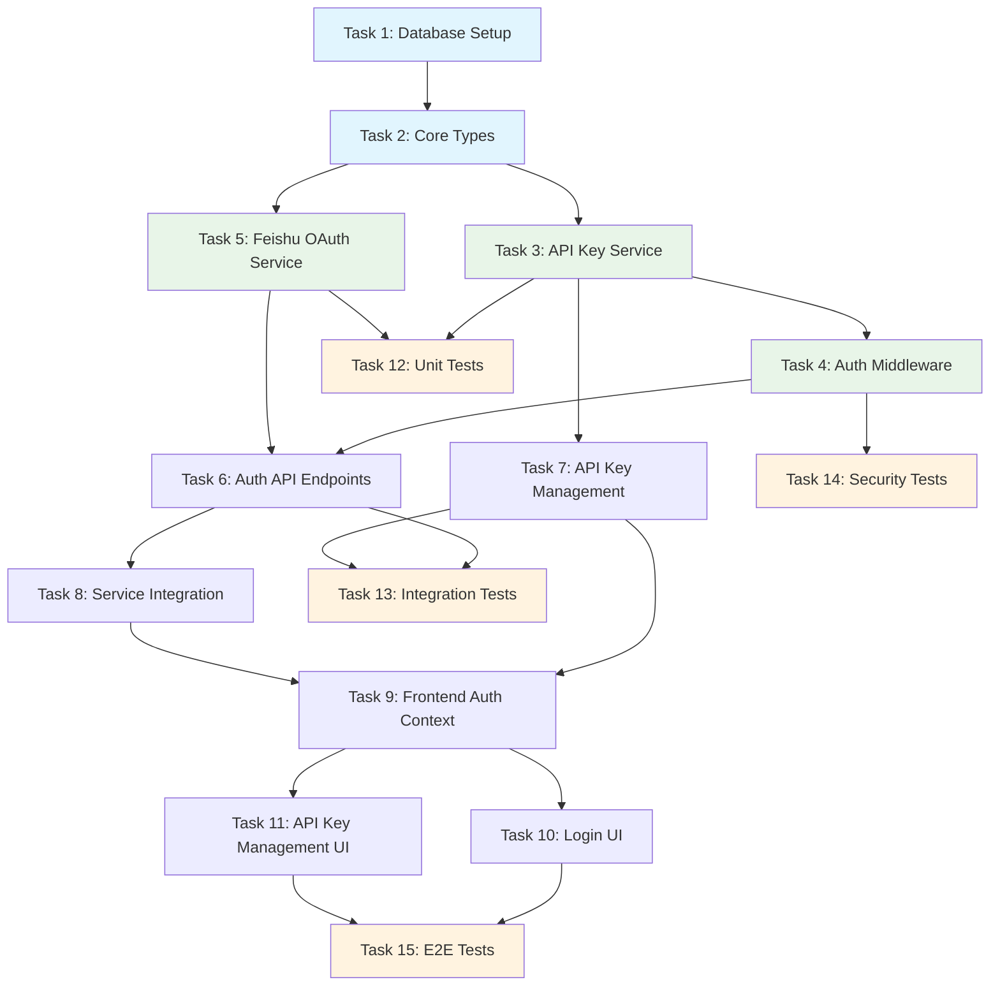

# Implementation Tasks Document

## Overview

This document provides a comprehensive, actionable implementation plan for the authentication system based on the current project state, requirements, and design. The tasks are organized by priority and dependencies, focusing on completing the core authentication functionality while ensuring security, performance, and maintainability.

## Task Dependencies Diagram

## Core Infrastructure Tasks

- [x] 1. Complete Database Setup and Migrations
  - **Files**: `prisma/schema.prisma`, `prisma/migrations/`
  - Review and validate existing database schema for completeness
  - Ensure all necessary indexes are in place for performance
  - Create and run database migrations if needed
  - Verify foreign key relationships and constraints
  - **Purpose**: Ensure data persistence layer is ready for authentication system
  - **Requirements**: 1.2, 2.5, 3.4, 4.1
  - **Dependencies**: None
  - **Testing**: Verify database connections, test schema constraints

- [x] 2. Define Authentication Types and Interfaces
  - **Files**: `src/types/auth.ts` (create if missing)
  - Create TypeScript interfaces for User, ApiKey, AuthResult, and AuthEvent
  - Define authentication-related request/response types
  - Extend existing type system with authentication-specific types
  - Ensure type alignment with database schema and API contracts
  - **Purpose**: Establish type safety for authentication implementation
  - **Requirements**: 1.3, 2.6, 3.7, 4.2
  - **Dependencies**: Task 1
  - **Testing**: Type compilation, interface compatibility tests

## Core Authentication Services

- [x] 3. Implement API Key Generation and Validation Service
  - **Files**: `src/auth/apiKey.ts` (review/complete existing)
  - Implement cryptographically secure API key generation with `sk-` prefix
  - Create bcrypt hashing with proper salt rounds
  - Implement constant-time comparison for validation
  - Add key prefix extraction for cache optimization
  - Include key format validation and metadata handling
  - **Purpose**: Provide secure API key management functionality
  - **Requirements**: 2.1, 2.2, 2.3, 5.1, 5.2
  - **Dependencies**: Task 2
  - **Testing**: Unit tests for key generation, hashing, validation, security tests

- [x] 4. Create Authentication Middleware
  - **Files**: `src/middleware/auth.ts` (review/complete existing)
  - Implement Fastify preHandler hook for API key validation
  - Add support for multiple authentication methods (Bearer token, X-Api-Key)
  - Implement proper error handling with appropriate HTTP status codes
  - Add user context attachment to request object
  - Include performance optimizations and logging integration
  - **Purpose**: Protect API endpoints with authentication checks
  - **Requirements**: 2.1, 2.4, 2.6
  - **Dependencies**: Task 3
  - **Testing**: Middleware integration tests, authentication flow tests, error handling tests

- [x] 5. Implement Feishu OAuth Service
  - **Files**: `src/auth/feishu.ts` (review/complete existing)
  - Implement OAuth URL generation with secure state parameter
  - Add callback handling with authorization code exchange
  - Include user information retrieval and synchronization
  - Implement user creation and identity linking logic
  - Add session management integration
  - **Purpose**: Enable user authentication via Feishu platform
  - **Requirements**: 1.1, 1.2, 1.3, 1.5, 5.4
  - **Dependencies**: Task 2
  - **Testing**: OAuth flow tests, user creation tests, error handling tests

## API Layer Implementation

- [x] 6. Implement Authentication API Endpoints
  - **Files**: `src/api/auth.ts` (review/complete existing)
  - Create `/auth/feishu` redirect endpoint with proper validation
  - Implement `/auth/feishu/callback` handler with state verification
  - Add `/auth/logout` endpoint with session cleanup
  - Create `/api/me` endpoint for current user information
  - Include proper error handling and security measures
  - **Purpose**: Provide HTTP interface for authentication operations
  - **Requirements**: 1.1, 1.4, 4.3
  - **Dependencies**: Task 5
  - **Testing**: API endpoint tests, authentication flow tests, security tests

- [x] 7. Complete API Key Management Endpoints
  - **Files**: `src/api/keys.ts` (review/complete existing)
  - Implement POST `/api/keys` with secure key creation and one-time display
  - Add GET `/api/keys` with proper filtering and pagination
  - Create PUT `/api/keys/{keyId}` for name and status updates
  - Implement DELETE `/api/keys/{keyId}` with confirmation workflow
  - Include proper validation, authorization, and error handling
  - **Purpose**: Provide CRUD interface for API key management
  - **Requirements**: 3.1, 3.2, 3.3, 3.4, 3.5, 3.6
  - **Dependencies**: Task 3
  - **Testing**: CRUD operation tests, authorization tests, security tests

- [x] 8. Integrate Services and Coordinate System
  - **Files**: `src/services/`, integration points across existing services
  - Ensure proper integration between authentication and logging systems
  - Implement event-driven communication between services
  - Add proper error propagation and recovery mechanisms
  - Include performance monitoring and health checks
  - Create service configuration and initialization logic
  - **Purpose**: Ensure all authentication components work together seamlessly
  - **Requirements**: All requirements (system integration)
  - **Dependencies**: Tasks 4, 5, 6, 7
  - **Testing**: Integration tests, end-to-end flow tests, performance tests

## Frontend Implementation

- [x] 9. Create Authentication Context and Hooks
  - **Files**: `ui/src/contexts/AuthContext.tsx`, `ui/src/hooks/useAuth.ts` (create if missing)
  - Implement authentication state management with proper TypeScript typing
  - Add login/logout functionality with session handling
  - Create protected route components and route guards
  - Include session timeout handling and refresh mechanisms
  - Add error handling and user feedback systems
  - **Purpose**: Manage frontend authentication state and routing
  - **Requirements**: 1.1, 1.4, 4.3
  - **Dependencies**: Task 6
  - **Testing**: Context tests, hook tests, route protection tests

- [x] 10. Implement Login Page Component
  - **Files**: `ui/src/pages/LoginPage.tsx` (create if missing)
  - Create Feishu OAuth login button with proper redirect handling
  - Add loading states and error handling with user-friendly messages
  - Implement responsive design and accessibility features
  - Include branding and consistent UI styling
  - Add session state indicators and user feedback
  - **Purpose**: Provide user interface for authentication
  - **Requirements**: 1.1, 1.7
  - **Dependencies**: Task 9
  - **Testing**: Component tests, accessibility tests, user interaction tests

- [x] 11. Create API Key Management Interface
  - **Files**: `ui/src/pages/ApiKeyManagementPage.tsx` (create if missing)
  - Implement key listing with status indicators and metadata display
  - Create secure key creation modal with one-time display functionality
  - Add key editing interface for names and status changes
  - Implement deletion flow with proper confirmation dialogs
  - **Purpose**: Provide user interface for API key operations
  - **Requirements**: 3.1, 3.2, 3.3, 3.4, 3.5, 3.6
  - **Dependencies**: Task 7, Task 9
  - **Testing**: Component tests, security tests, user workflow tests

## Testing and Validation

- [x] 12. Create Comprehensive Unit Tests
  - **Files**: `test/auth/`, `test/services/`, `test/middleware/`
  - Test API key generation, hashing, and validation logic
  - Add OAuth service functionality tests with mocked dependencies
  - Include authentication middleware tests with various scenarios
  - Cover all utility functions and helper methods
  - **Purpose**: Ensure individual components work correctly in isolation
  - **Requirements**: All functional requirements
  - **Dependencies**: Tasks 3, 4, 5, 6
  - **Coverage**: Target >90% code coverage for authentication components

- [x] 13. Implement Integration Tests
  - **Files**: `test/api/`, `test/integration/`
  - Test complete authentication flows from API request to response
  - Add API key management CRUD tests with database integration
  - Test service integration and communication between components
  - Verify database operations and transaction handling
  - **Purpose**: Ensure components work together correctly
  - **Requirements**: All requirements with system interactions
  - **Dependencies**: Tasks 6, 7, 8
  - **Testing**: End-to-end API tests, database integration tests, service communication tests

- [x] 14. Conduct Security Testing and Validation
  - **Files**: `test/security/`
  - Test API key security (no leakage, proper hashing, timing attacks)
  - Validate session security and CSRF protection mechanisms
  - Test rate limiting and access control under various conditions
  - Include authentication bypass attempts and input validation tests
  - Test for common web security vulnerabilities (XSS, injection, etc.)
  - **Purpose**: Validate security measures are effective and robust
  - **Requirements**: 5.1, 5.2, 5.3, 5.4
  - **Dependencies**: Tasks 4, 6, 7
  - **Testing**: Penetration tests, security scans, vulnerability assessments

- [x] 15. Perform End-to-End Testing
  - **Files**: `test/e2e/`
  - Test complete user workflows from login to API key management
  - Include browser automation tests for UI interactions
  - Test API key configuration and validation from user perspective
  - Verify cross-browser compatibility and responsive design
  - Include performance testing under realistic user loads
  - **Purpose**: Ensure complete user workflows function correctly
  - **Requirements**: All user-facing requirements
  - **Dependencies**: Tasks 10, 11
  - **Testing**: User journey tests, browser automation tests, performance tests

## Configuration and Deployment

- [ ] 16. Configure System Settings and Environment
  - **Files**: Configuration files, environment setup
  - Configure Feishu OAuth application credentials securely
  - Set up session keys and cookie security settings
  - Configure database connection and cache settings
  - Set up rate limiting parameters and access control defaults
  - Configure logging and monitoring for authentication events
  - **Purpose**: Ensure system is properly configured for production
  - **Requirements**: 5.3, 5.4
  - **Dependencies**: Tasks 1-15
  - **Testing**: Configuration validation tests, environment-specific tests

## Documentation and Maintenance

- [ ] 17. Create Technical Documentation
  - **Files**: Documentation files, README updates
  - Document API endpoints with examples and authentication requirements
  - Create troubleshooting guides for common authentication issues
  - Document security best practices and configuration guidelines
  - Include developer setup instructions and testing guidelines
  - **Purpose**: Provide comprehensive documentation for maintenance and development
  - **Requirements**: Maintainability and knowledge transfer
  - **Dependencies**: All implementation tasks
  - **Testing**: Documentation review, technical accuracy validation

## Implementation Guidelines

### Security Requirements

- All API keys must be hashed using bcrypt with appropriate salt rounds
- Authentication must use constant-time comparison to prevent timing attacks
- Session cookies must use secure flags (HttpOnly, Secure, SameSite)
- OAuth state parameters must be properly validated to prevent CSRF
- Rate limiting must be enforced to prevent brute force attacks
- Sensitive data must never be logged or exposed in error messages

### Performance Requirements

- API key validation must complete within 50ms P99 (excluding database queries)
- User login processing must complete within 500ms P99 (excluding external API calls)
- Database queries must be optimized with proper indexes
- Caching must be implemented for frequently accessed data
- Authentication middleware must not significantly impact request processing time

### Testing Requirements

- All components must have unit tests with >90% code coverage
- All API endpoints must have integration tests
- All user workflows must have end-to-end tests
- Security tests must validate protection against common vulnerabilities
- Performance tests must validate system behavior under load

### Code Quality Requirements

- All code must follow existing project conventions and patterns
- TypeScript must be used with strict type checking enabled
- All functions must have proper error handling and logging
- All interfaces must be properly documented with examples
- Code must be reviewed for security vulnerabilities before deployment

## Success Criteria

The authentication system implementation will be considered complete when:

1. **Functional Requirements**: All user stories from the requirements document are fully implemented and tested
2. **Security Requirements**: All security measures are implemented and validated through security testing
3. **Performance Requirements**: All performance targets are met under realistic load conditions
4. **Code Quality**: Code coverage targets are met, and code follows project standards
5. **Documentation**: Comprehensive documentation is available for maintenance and development
6. **Integration**: System integrates seamlessly with existing components and external services

## Risk Mitigation

### Technical Risks

- **Database Performance**: Implement proper indexing and query optimization
- **Security Vulnerabilities**: Conduct regular security audits and penetration testing
- **Service Dependencies**: Implement proper error handling and fallback mechanisms
- **Scalability Issues**: Design for horizontal scaling and load distribution

### Operational Risks

- **Configuration Errors**: Implement configuration validation and error reporting
- **Session Management**: Implement proper session cleanup and timeout handling
- **User Experience**: Provide clear error messages and user-friendly interfaces
- **Monitoring**: Implement comprehensive logging and monitoring for authentication events

This tasks document provides a comprehensive roadmap for implementing the authentication system while ensuring security, performance, and maintainability. Each task includes specific requirements, dependencies, and testing criteria to ensure successful implementation.
