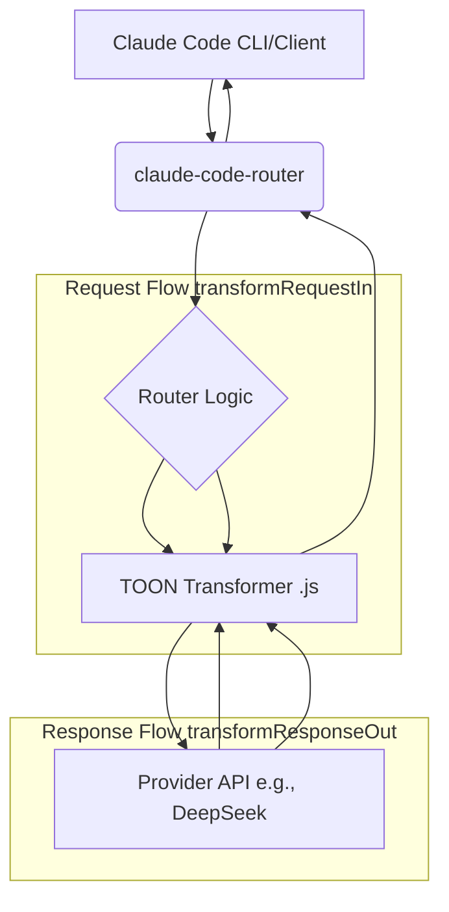

# Design Document

## Overview

本功能将被实现为 `claude-code-router` 的一个**自定义转换器 (Custom Transformer)**。这个转换器是一个独立的、由用户提供的 JavaScript 文件，它利用 `@byjohann/toon` 库 来实现。

它的核心职责是拦截传向 LLM 的出站请求 (`transformRequestIn`)，扫描消息内容中的 JSON 字符串，并将其动态编码为 token 效率更高的 TOON 格式。

## Steering Document Alignment

### Technical Standards (tech.md)

本设计严格遵守 `claude-code-router` 既定的**插件和转换器架构**。它利用 `config.json` 中明确定义的 `transformers` 数组（用于加载自定义 .js 文件和传递选项）以及 `Providers` 内部的 `transformer.use` 数组 来应用逻辑。

### Project Structure (structure.md)

此功能**不会**修改 `claude-code-router` 的任何核心代码。它将作为一个独立的文件（例如 `toon-transformer.js`）存在于用户的文件系统中（例如，在 `~/.claude-code-router/plugins/` 目录下）。`claude-code-router` 通过 `config.json` 中的 `path` 字段 按需加载它，这完全符合项目解耦和用户自定义的结构。

## Code Reuse Analysis

### Existing Components to Leverage

- **`claude-code-router` 转换器服务**: 我们将依赖 `claude-code-router` 底层服务（`@musistudio/llms`）来加载自定义转换器类，并在 `config.json` 中 注册它。
- **`claude-code-router` 配置系统**: 利用 `transformers` 数组传递 `path` 和 `options`，以及利用 `Provider` 中的 `transformer.use` 来启用它。

### Integration Points

- **`@byjohann/toon` 库**: 这是一个新的外部依赖，必须由用户手动安装 (`npm install @byjohann/toon`)。我们将主要使用其 `encode` 函数。

## Architecture

本设计采用**拦截器 (Interceptor) / 插件 (Plugin)** 模式，这与 `claude-code-router` 的转换器架构 一致。

### Modular Design Principles

- **Single File Responsibility**: `toon-transformer.js` 文件将只负责一件事：JSON 到 TOON 的转换。
- **Component Isolation**: 转换器是完全隔离的。如果它失败了（见错误处理），它不会破坏 `claude-code-router` 的核心路由或日志记录功能。
- **Service Layer Separation**: 转换器在请求到达路由逻辑之后、发送到下游 API 之前精确地运行在服务层，保持了清晰的关注点分离。
- **Utility Modularity**: 转换器作为一个独立的工具模块，可以在不同的 Provider 中重用。



## Components and Interfaces

### Component 1: `ToonTransformer` (在 `toon-transformer.js` 中)

- **Purpose:** 拦截出站请求，查找 `messages` 中类型为 `text` 且内容为 JSON 字符串的块，并将其编码为 TOON 格式。
- **Interfaces:**
  - `constructor(options)`: 接收来自 `config.json` 中 `transformers` 条目的 `options` 对象。这些 `options`（例如 `delimiter`, `lengthMarker`）将被存储为类实例属性。
  - `name (property)`: 一个 `string` 类型的 getter，返回转换器的唯一名称（例如 `"toon-encoder"`），用于在 `transformer.use` 中引用。
  - `transformRequestIn(req)`:
      1. 从 `req.body.messages` 循环遍历消息。
      2. 对于 `role: 'user'` 的消息，循环遍历 `content` 数组。
      3. IF `contentBlock.type === 'text'`。
      4. 使用 `try...catch` 块尝试 `JSON.parse(contentBlock.text)`。
      5. IF 解析成功：
          a.  调用 `toon.encode(parsedJson, this.options)`。
          b.  将 `contentBlock.text` 替换为 `\x60\x60\x60toon\n${toonString}\n\x60\x60\x60`。
      6. IF 解析失败：`catch` 异常并记录警告日志（参见错误处理）。
      7. 返回修改后的 `req`。
  - `transformResponseOut(res)`:
      1. 直接 `return res;`。此转换器不修改响应。
- **Dependencies:** `@byjohann/toon`
- **Reuses:** `claude-code-router` 的转换器加载机制。

## Data Models

### Model 1: `config.json` 中的转换器注册

```json
// 在 config.json 顶层
"transformers": [
  {
    "path": "/path/to/your/toon-transformer.js",
    "options": {
      "delimiter": "\t",
      "lengthMarker": "#"
    }
  }
],
```

### Model 2: `config.json` 中的转换器应用

```json
// 在 config.json -> Providers 数组的某个元素中
"Providers": [
  {
    "name": "deepseek",
    // ...
    "transformer": {
      "use": ["deepseek", "toon-encoder"]
    }
  }
]
```

## Error Handling

### Error Scenarios

1. **Scenario 1:** 消息内容不是有效的 JSON。
   - **Handling:** `JSON.parse()` 将抛出异常。`transformRequestIn` 中的 `try...catch` 块将捕获此异常。转换器应记录一个 `WARN` 级别的日志（例如："TOON Transformer: Skipping block, not valid JSON."），然后*不修改*该 `contentBlock`，继续处理下一个块。
   - **User Impact:** 无。请求将按原样（使用未转换的文本）发送到 LLM。

2. **Scenario 2:** `toon.encode` 函数失败（例如，由于数据结构不受支持）。
   - **Handling:** `toon.encode()` 将抛出异常。`try...catch` 块将捕获此异常。转换器应记录一个 `ERROR` 级别的日志（例如："TOON Transformer: Encoding failed." 并附带错误信息），然后*不修改*该 `contentBlock`（即保留原始的、有效的 JSON）。
   - **User Impact:** 无。请求将按原样（使用未转换的 JSON）发送到 LLM。用户不会享受到该次调用的 token 节省。

## Testing Strategy

### Unit Testing

- **`transformRequestIn` (Mocked `toon.encode`)**:
  - **Test 1 (Happy Path):** 传入一个包含有效 JSON 字符串的消息体。断言 `toon.encode` 被调用，并且 `contentBlock.text` 被替换为 ` ```toon... ` 格式的字符串。
  - **Test 2 (Invalid JSON):** 传入一个包含无效 JSON（例如 `"{key: "no quotes"}"`）的消息体。断言 `toon.encode` *未*被调用，并且 `contentBlock.text` 保持不变。
  - **Test 3 (Plain Text):** 传入一个 `"Hello world"` 消息体。断言 `JSON.parse` 和 `toon.encode` 均未被调用，`contentBlock.text` 保持不变。
  - **Test 4 (Options):** 传入一个 `options`（例如 `{ delimiter: '|' }`）来构造类实例。断言 `toon.encode` 在被调用时收到了正确的 `options` 对象。

### Integration Testing

- **Integration testing approach:** 手动集成测试，通过完整的配置和请求流程验证转换器在实际环境中的工作情况。
- **Key flows to test:**
  - Setup: `npm install @byjohann/toon`，创建 `toon-transformer.js` 文件，配置 `config.json`，设置 `LOG_LEVEL` 为 `debug`。
  - Test Flow: 使用 `ccr code` 启动服务，发送包含大型 JSON 字符串的提示，检查日志显示请求已被 `toon-encoder` 处理，并验证发送到下游 API 的请求体包含 TOON 格式字符串。

### End-to-End Testing

- **E2E testing approach:** 端到端测试验证从用户输入到 LLM 响应的完整流程，确保 TOON 转换不影响功能的正确性。
- **User scenarios to test:** 用户通过 Claude Code 发送包含 JSON 数据的复杂请求，验证 token 使用量的减少和响应内容的正确性。
